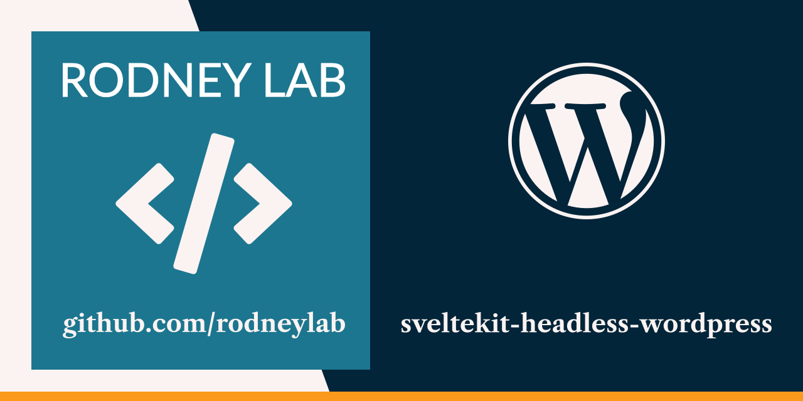

  

<h1 align="center">
  Get Started with SvelteKit Headless WordPress
</h1>

## get-started-sveltekit-headless-wordpress

Starter content for the <a aria-label="Open Rodney Lab Svelte Kit Headless Word Press tutorial" href="https://plus.rodneylab.com/tutorials/get-started-sveltekit-headless-wordpress">Get Started with SvelteKit Headless WordPress tutorial</a>.  Head over there to get started!

Feel free to jump into the [Rodney Lab matrix chat room](https://matrix.to/#/%23rodney:matrix.org).
